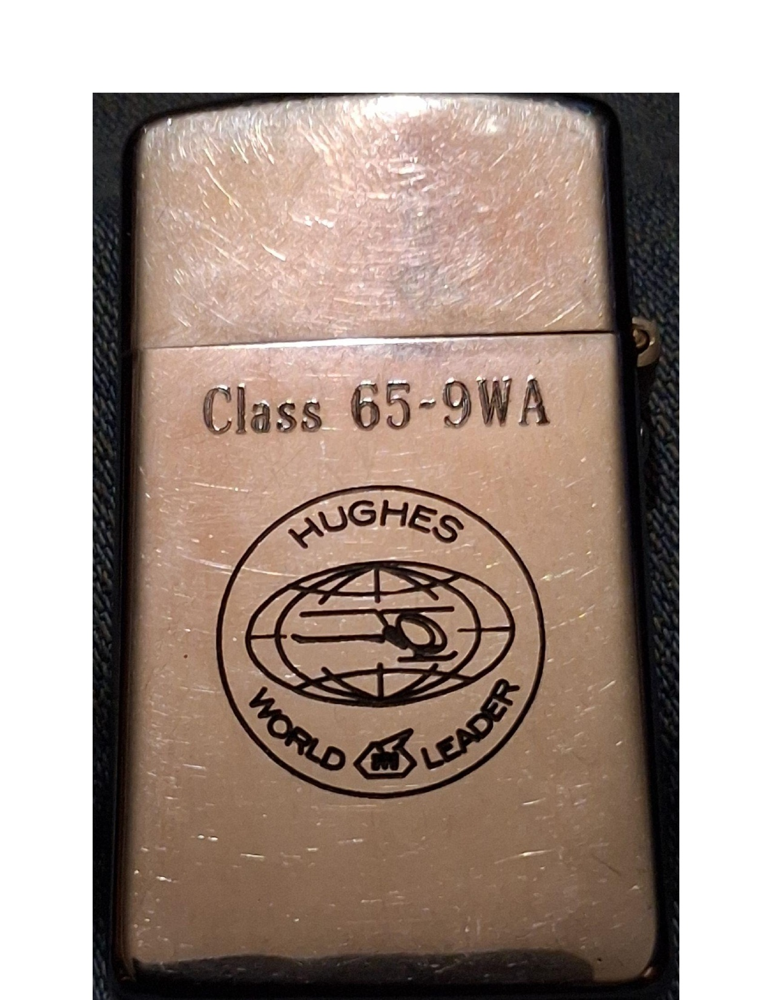
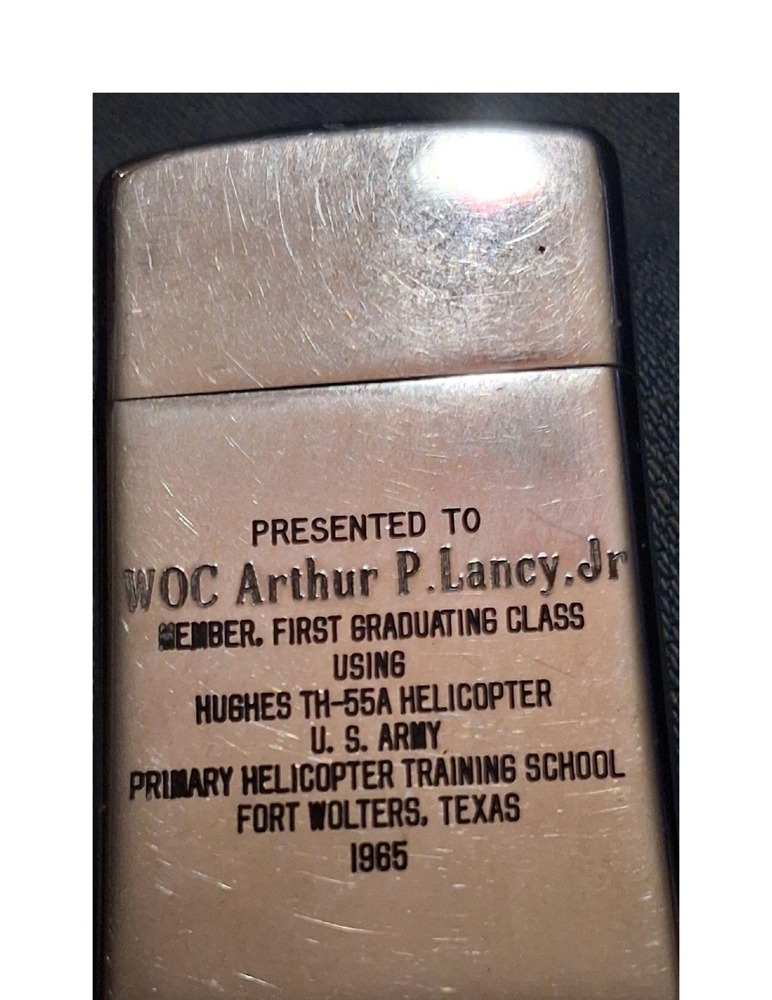
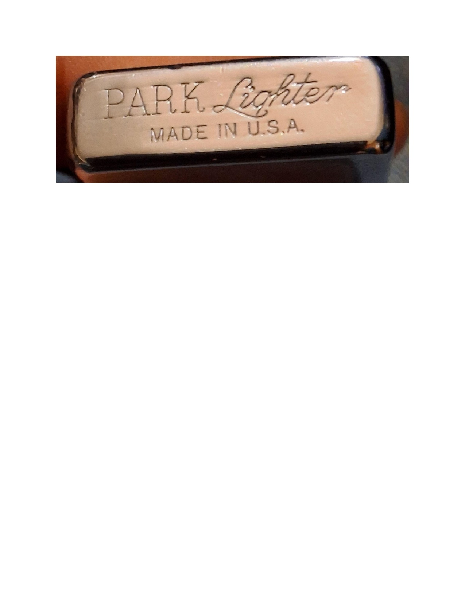
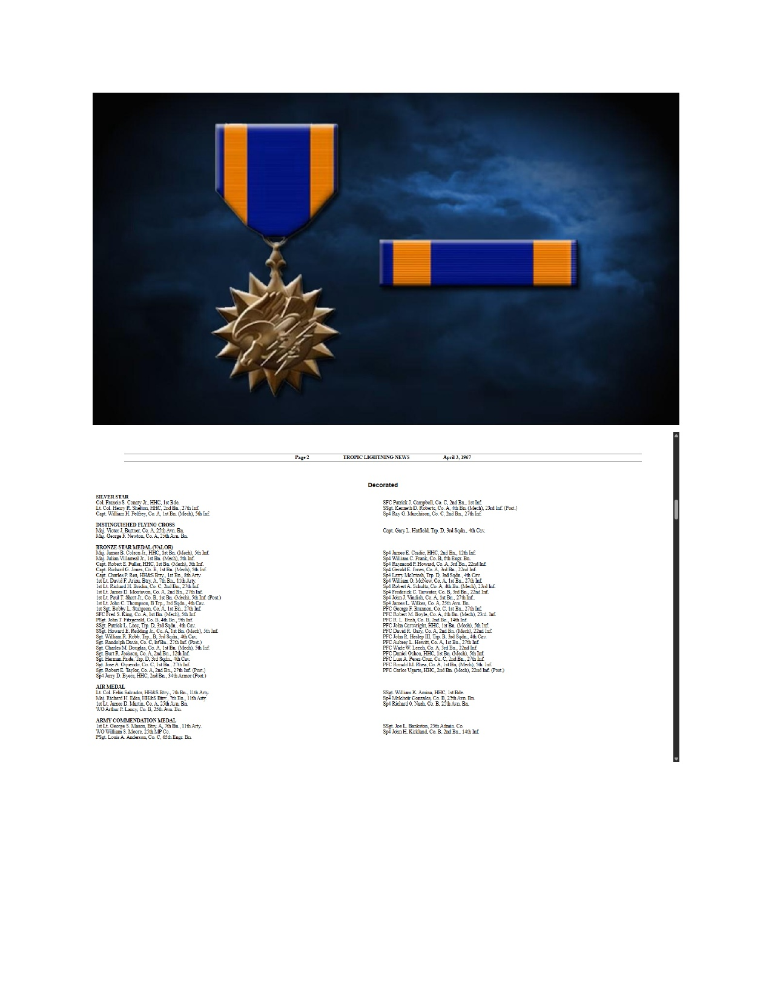
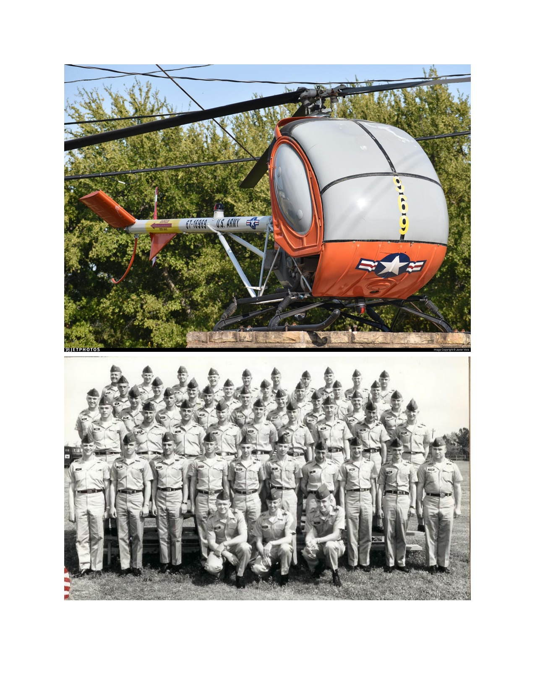
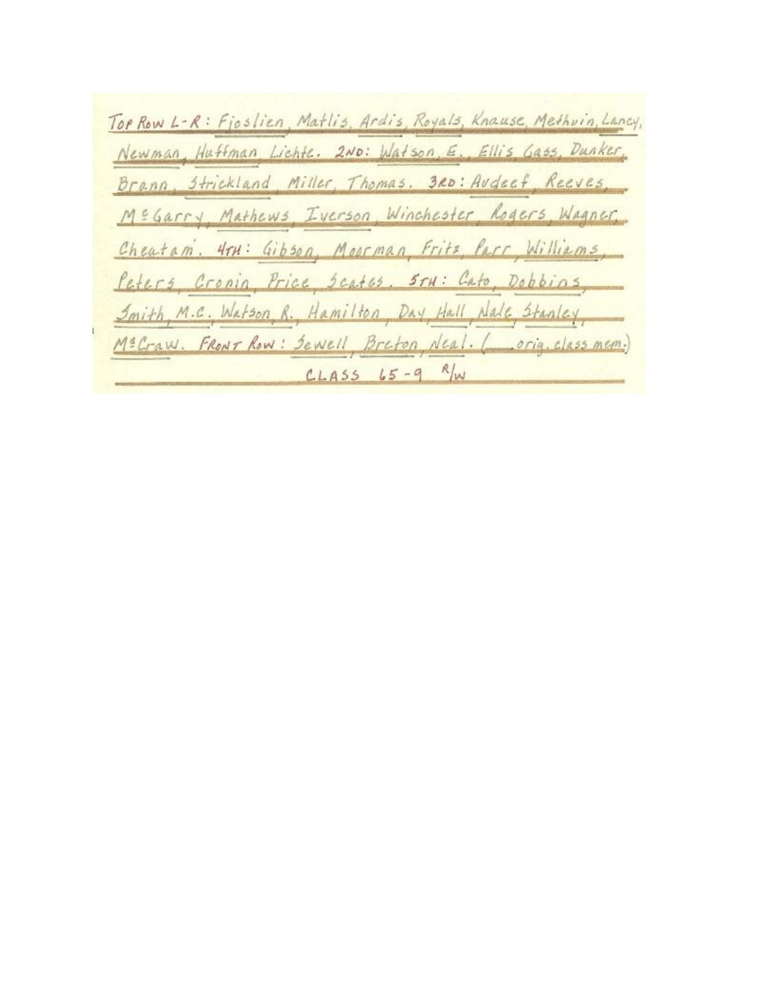

# The 1965 Fort Wolters Commemorative Lighter: A Historical Artifact

  

## Executive Summary

This document provides a comprehensive and factual overview of the 1965 Fort Wolters Commemorative Lighter, an authenticated artifact that encapsulates a pivotal moment in U.S. Army Aviation history. This unique presentation piece, originally belonging to Warrant Officer Candidate (WOC) Arthur P. Lancy Jr., serves as a tangible link to the inaugural class of helicopter pilots trained on the Hughes TH-55A Osage at Fort Wolters, Texas. Its verified provenance, historical significance, and exceptional condition position it as a highly valuable collectible.

## Artifact Identification

| Attribute         | Detail                                      |
| :---------------- | :------------------------------------------ |
| **Object**        | 1965 Park Industries Presentation Lighter   |
| **Reference ID**  | FW-ARC-0001 / ALJ-65-9WA-COA-001            |
| **Manufacturer**  | Park Industries, Murfreesboro, Tennessee, U.S.A. |
| **Material**      | Brushed Metal Alloy (Chromed)               |
| **Era**           | 1965 (Vietnam War Era)                      |
| **Condition**     | Museum Quality / Excellent                  |
| **Functional Status** | Operational                               |

## Historical Context: The Dawn of a New Era in Army Aviation

The Fort Wolters Primary Helicopter Training School in Texas was a critical institution for the U.S. Army from 1956 to 1973, responsible for training over 40,000 helicopter pilots during the Vietnam War era. A significant turning point occurred in 1965 with the introduction of the **Hughes TH-55A Osage** as the primary training helicopter, replacing earlier models. This transition marked a revolutionary advancement in helicopter training methodology, directly contributing to the rapid expansion of Army Aviation capabilities during a period of intense global conflict [1], [2].

This commemorative lighter was presented to a member of **Class 65-9WA**, the *first* graduating class to train exclusively on the TH-55A Osage. This makes the artifact exceptionally significant, as it symbolizes the beginning of a new chapter in Army aviation and the rigorous training undertaken by these pioneering aviators.

## Recipient and Verified Provenance

The lighter is engraved to **Warrant Officer Candidate Arthur P. Lancy Jr.**, a participant in the Warrant Officer Candidate (WOC) program. This program was designed to train enlisted soldiers and junior officers to become Army aviators, culminating in their commissioning as Warrant Officers upon graduation. The personal engraving elevates the artifact beyond a generic military souvenir, connecting it directly to an individual's service and achievement [2].

Crucially, WOC Lancy Jr.'s military service record has been thoroughly authenticated through official Army archives. Records confirm that he was awarded the **Air Medal for meritorious achievement in aerial flight** on April 3, 1967, while serving with Company B, 25th Aviation Battalion, 25th Infantry Division, during the Vietnam War. This documented service trajectory, from specialized training at Fort Wolters to combat distinction, provides an exceptionally compelling and verifiable historical narrative, enhancing the artifact's authenticity and value [1], [2].

**Chain of Custody:** Original recipient (WOC Arthur P. Lancy Jr.) → Private collection → Current archive (Acquired November 15, 2024).

## Technical Specifications and Markings

This vintage Park Brand Petrol Lighter features precise engravings that confirm its historical context:

*   **Front Markings:** Clearly displays 
the **Class 65-9WA** designation and the **Hughes World Leader logo**, signifying the aircraft on which the recipient trained.
*   **Reverse Markings:** Features a presentation inscription to **WOC Arthur P. Lancy Jr.**, along with **Fort Wolters, Texas, 1965**, solidifying its origin and purpose.

The lighter bears authentic manufacturing marks from Park Industries, Murfreesboro, Tennessee, consistent with 1960s production standards. The engravings exhibit period-accurate typography and depth, confirming its contemporary manufacture and not a later reproduction [1].

## Valuation and Rarity

This 1965 Fort Wolters Commemorative Lighter is considered an **investment-grade military collectible** due to its confluence of historical significance, verified provenance, and exceptional rarity. Its estimated market value is **$895** [1].

**Key factors contributing to its value:**

*   **Historical Rarity:** Presentation lighters from the *first* graduating class of a new, pivotal military training program are exceptionally rare. Most military presentation pieces from this era were either lost, destroyed, or remain in private collections with limited documentation. This example comes with complete provenance and a verifiable recipient service record [1].
*   **Documented Combat Service:** The direct link to WOC Arthur P. Lancy Jr. and his documented Air Medal for combat service significantly enhances its appeal to collectors of Vietnam War memorabilia and aviation history.
*   **Collector Appeal:** The artifact attracts a broad spectrum of collectors, including military history enthusiasts, Vietnam War specialists, aviation memorabilia collectors, presentation piece collectors, and Fort Wolters historians. This multi-category interest ensures strong and sustained demand in the collector market [1].
*   **Appreciating Asset:** Authenticated military presentation pieces with complete provenance consistently demonstrate appreciation in the collector market, particularly when tied to specific historical events and documented service records [1].

## Visual Documentation

Below are key visual elements that document the artifact and its historical context.

### Artifact Views

*Figure 1: Front view of the lighter, showing the Class 65-9WA and Hughes World Leader logo.*

*Figure 2: Reverse side of the lighter, with the presentation inscription to WOC Arthur P. Lancy Jr.*

*Figure 3: Detailed view of the reverse side inscription.*

### Supporting Historical Documentation

*Figure 4: Documentation related to the Air Medal awarded to WOC Arthur P. Lancy Jr.*

*Figure 5: Historical photograph of the Hughes TH-55A Osage training helicopter and a class photo.*

*Figure 6: Roster for Class 65-9, confirming WOC Arthur P. Lancy Jr.'s participation.*

## References

[1] `lighter-showcase` repository. (n.d.). Retrieved from `https://github.com/Mave9055/lighter-showcase`
[2] `fort-wolters-archive` repository. (n.d.). Retrieved from `https://github.com/Mave9055/fort-wolters-archive`
[3] `lighter-value-analysis` repository. (n.d.). Retrieved from `https://github.com/Mave9055/lighter-value-analysis`